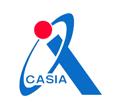

<strong>About me：</strong>I am a postdoctoral fellow at the Multimedia Information Processing Laboratory in Kiel University, Germany，I studied under Professor Reinhard Koch, the founder of the SFM method and the winner of the Marr Prize in 1998, the highest award in machine vision.I received Ph.D degree in 2016 under the supervision of Prof. Hong Liu from the EECS department, Peking University (PKU), China. In 2006, I served as a visiting scholar at California State University (San Jose) . I have collaborated with the  China Academy of Space Technology  and  participated in the panoramic reconstruction of the lunar surface of the Chang'e lunar landing plan as a core person in charge of algorithm. I served as a deputy senior engineer at the Chinese Academy of Sciences Institute of Automation , and in 2016, as the core founder, I participated in the creation of a specialized and innovative AI+ security company in Beijing，China. In 2018, as a  technical partner, I established a provincial-level specialized AI+ robot company in Zhejiang Province with a valuation of 1 billion within 4 years.
I have published many papers in flagship conferences and journals such as IEEE TIP, ACM MM, IEEE TMM, ICRA, ICASSP, SPL, etc., and have authorized more than 40 national invention patents.

## Research Interests

- Computer Vision
- Robotics
- 3D Sensing
- 3D Reconstruction

## Education and Experience

  

    
  

  

    

      2022-Now&nbsp;&nbsp;&nbsp;&nbsp; Postdoctoral fellow，Kiel University  
      Study light field system calibration and light field reconstruction  
      Laboratory home page: <a href="https://www.mip.informatik.uni-kiel.de/en/team" style="color: #0066FF;">https://www.mip.informatik.uni-kiel.de/en/team</a>
    

  

  

    
  

  

    

      2020-2022&nbsp;&nbsp;&nbsp;&nbsp;&nbsp;Technical Partner and Director，Linx Robot  
      Lead China’s first multi-category, no prior robotic arm depalletizing system 
      Lead the new generation of domestically produced full range of 3D sensor software and hardware product lines 
      Lead China’s first 2.5D high-precision optical inspection system
    

  

  

    
  

  

    

       2016-2020 &nbsp;&nbsp;&nbsp;&nbsp; Assistant researcher and senior engineer，Chinese Academy of Sciences Institute of Automation（CASIA）  
      Core founder of a specialized and sophisticated  AI+ security enterprises 
    

  

  

    
  

  

    

      2015-2016&nbsp;&nbsp;&nbsp;&nbsp; Researcher in basic research position，Tencent  
      Led the Tencent-Tsinghua Joint Laboratory and researched virtual reality panoramic video technology
    

  

  

    
  

  

    

      2011-2016&nbsp;&nbsp;&nbsp;&nbsp; Doctor of Computer Applied Technology， Peking University   
      2009-2011&nbsp;&nbsp;&nbsp;&nbsp;Master of Electronic Science and Technology，Peking University  
    

  

  

    
  

  

    

      2006-2007&nbsp;&nbsp;&nbsp;&nbsp; Visiting scholar， California State University （San Jose）   
      2005-2009&nbsp;&nbsp;&nbsp;&nbsp; Bachelor of Electronic Information Engineering， QingDao University 
    

  

## News

  
the 12th International Conference of Computational Visual Media

  As the Session Chair 
  

    

      
    

    

      
    

  

## Projects

  
Zhejiang Provincial Key Research and Development Plan

  Czech partner visited the company 
  

    

      
    

  

  
Hangzhou AI Major Science and Technology Innovation Project

  Intelligent warehousing and logistics 
  

    

      <video controls style="width: 100%; max-width: 100%; height: auto;">
        <source src="/assets/video/project 01.mp4" type="video/mp4">
        Your browser does not support the video tag.
      </video>
    

    

      <video controls style="width: 100%; max-width: 100%; height: auto;">
        <source src="/assets/video/project 02.mp4" type="video/mp4">
        Your browser does not support the video tag.
      </video>
    

    

      <video controls style="width: 100%; max-width: 100%; height: auto;">
        <source src="/assets/video/project 03.mp4" type="video/mp4">
        Your browser does not support the video tag.
      </video>
    

  

  



